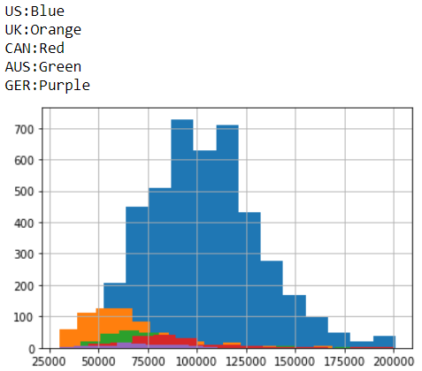
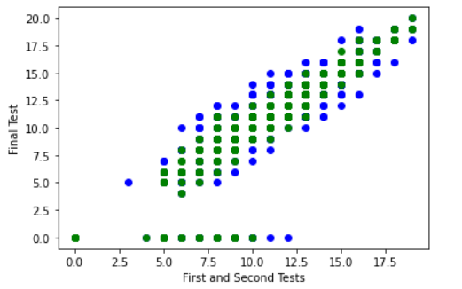

# Project Portfolio

## Data Professional Salary Analysis

An EDA project focused on comparing and contrasting the salaries of data professionals from around the world with particular emphasis on the US.

The largest factors correlating with salary were the country in which the survey participant worked and their job title. Additionally, data professionals in the US earn between $10,00-$40,000 more compared to the other top 5 responding countries in the survey regardless of experience or education, with no significant differences in salary between those holding a Bachelor's degree compared to a PhD.

[Link to files](https://github.com/FeranMorgan/DataProfessionalSalaryAnalysis)

## Linear Regression on Portuguese Math Scores
A project that trains models to predict math student's final test performance using simple and multiple linear regression using factors like daily and weekly alcohol consumption, romantic involvement and internet access.

Throughout the analysis I discovered that the above and other features had little influence on whether or not the students performed well. The best predictor of student performance on their final exam was found to be prior test performance. During optimization of the linear model, single variable regression gave an R-squared value of 0.7818 and the best combination of features for multiple regression gave an R-squared of 0.7978.

[Link to files](https://github.com/FeranMorgan/LinearRegressionPortugalMath)

## Tableau visualization for UC Berkeley Majors
A project focused on detailing the differences in starting salaries for UC Berkeley STEM majors with emphasis on comparing applied/concentrated majors with more generalized/research oriented majors.

This Tableau story illustrates that the applied STEM majors generally have much higher starting salaries than the other STEM majors at UC Berkeley when measured at the Bachelor's level. The top 5 earners on average were: Electrical Engineering and Computer Science, Data Science, Computer Science, Applied Mathematics, and Statistics.

[Link to files](https://github.com/FeranMorgan/TableauBerkeleyMajors)

## Mastermind Clone (console based)
Mastermind game supporting randomization for replayability, intelligent player feedback system, and game state checks.

[Link to files](https://github.com/FeranMorgan/MastermindClone)

### Contact me:
FeranMorgan@berkeley.edu

www.linkedin.com/in/feranmorgan
